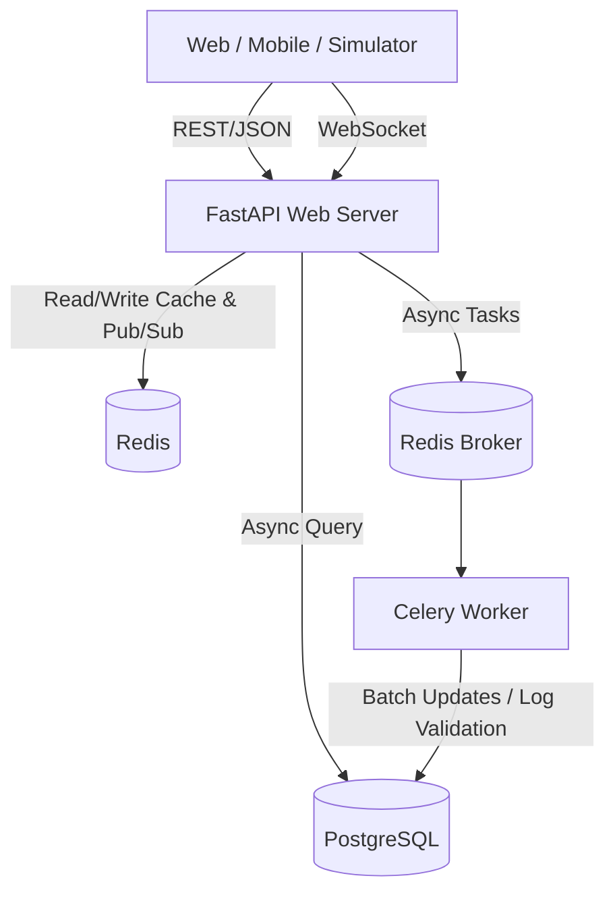

# Asynchronous Real-Time Analytics & Event Processing Engine

**Live Demo**: [https://event-processing-engine.onrender.com/](https://event-processing-engine.onrender.com/) *(Note: Render free tier containers sleep after 15 minutes of inactivity; please allow ~1 minute for the initial spin-up).*

A production-grade, highly concurrent event ingestion and real-time processing backend built using **FastAPI**, **PostgreSQL**, **Redis**, **Celery**, and **Docker**.

This system is designed as an SDE resume/portfolio project showing enterprise-level architecture: domain-driven structure, asynchronous ORM persistence, rolling hot-path analytics caching, horizontal WebSocket scaling via Redis Pub/Sub, background worker processing, and multi-stage Docker builds.

---

## Architecture Overview



### Core Technical Pillars

1. **Async-First Core**: Built entirely on FastAPI's asynchronous event loop (`async/await`) allowing high-throughput ingestion of events.
2. **Database Persistence**: Implemented asynchronous SQLAlchemy ORM utilizing `asyncpg` driver to insert and read from a PostgreSQL database without blocking the web worker threads.
3. **Hot-Path Caching**: Implements aggressive Redis caching of analytics aggregates (e.g. rolling total count, type breakdown) with rolling Time-To-Live (TTL) limits.
4. **Sliding-Window Metrics**: Tracks active users in the last hour using Redis Sorted Sets (ZSET) by timestamps, cleaning up expired users on every request.
5. **Scalable WebSocket Broadcasts**: Leverages Redis Pub/Sub to broadcast ingested events to websocket clients. When an event is ingested by any web instance, it is published to Redis and broadcast by all local WebSocket server managers—enabling horizontal clustering.
6. **Distributed Tasks**: Offloads heavy schema validations and anomaly checks to Celery background workers utilizing Redis as the message broker.
7. **OAuth2 Security**: Employs standard JWT tokens to secure REST endpoints and authorize WebSocket handshakes.
8. **Interactive Visual Dashboard**: A Tailwind CSS & Chart.js monitoring interface built directly into the server, showing real-time event logs, anomaly indicators, and charts.

---

## Directory Structure

```
event_processing_engine/
├── app/
│   ├── auth/              # Authentication & User Management Domain
│   │   ├── crud.py        # Database operations
│   │   ├── dependencies.py# JWT generation & dependency injection
│   │   ├── models.py      # User SQLAlchemy model
│   │   ├── router.py      # Signup/login endpoints
│   │   └── schemas.py     # Pydantic validation models
│   ├── events/            # Ingestion, Analytics & WebSocket Stream Domain
│   │   ├── manager.py     # WebSocket Connection Manager with Redis Pub/Sub
│   │   ├── models.py      # Event SQLAlchemy model
│   │   ├── router.py      # Ingest, stream & analytics endpoints
│   │   ├── schemas.py     # Ingest validation schemas
│   │   └── service.py     # Business logic & hot-path caching
│   ├── workers/           # Celery Worker Configuration & Background Tasks
│   │   ├── celery_app.py  # Celery instance initialisation
│   │   └── tasks.py       # Asynchronous validation & anomaly detection
│   ├── templates/
│   │   └── index.html     # Real-time console UI (Tailwind CSS, Chart.js)
│   ├── cache.py           # Redis pooling, caching helpers & Pub/Sub
│   ├── config.py          # Pydantic Settings management
│   ├── database.py        # Async engine & sessionmaker config
│   └── main.py            # Main app startup/shutdown lifespan hooks
├── Dockerfile             # Multi-stage production container setup
├── docker-compose.yml     # Multi-container orchestration config
├── requirements.txt       # Python package dependencies
├── simulate_traffic.py    # Auto-traffic simulator script
└── README.md
```

---

## Getting Started

### Option A: Run with Docker Compose (Recommended)

Make sure you have **Docker** and **Docker Compose** installed.

1. **Spin up all containers**:
   ```bash
   docker compose up --build
   ```
   This will download, build, and start:
   - PostgreSQL (`event_postgres` on port 5432)
   - Redis (`event_redis` on port 6379)
   - FastAPI Application (`event_web` on port 8000)
   - Celery Worker (`event_worker`)

2. **Access the Console**:
   Open [http://localhost:8000/](http://localhost:8000/) in your browser.

---

### Option B: Run Locally (Python Virtual Environment)

To run without Docker compose, you will need a running Redis server and PostgreSQL database locally.

1. **Create and Activate Virtual Environment**:
   ```bash
   python3 -m venv .venv
   source .venv/bin/activate
   ```

2. **Install Dependencies**:
   ```bash
   pip install -r requirements.txt
   ```

3. **Start the FastAPI Application**:
   ```bash
   uvicorn app.main:app --reload
   ```

4. **Start the Celery Worker** (in a separate terminal window/tab):
   ```bash
   celery -A app.workers.celery_app.celery worker --loglevel=info
   ```

---

## Simulating Traffic & Testing

We have built a concurrent traffic simulator client script to test the engine's ingestion speed and show real-time graphs.

1. Ensure the web server is running.
2. In a separate terminal, activate the virtual environment and run the simulator script:
   ```bash
   python3 simulate_traffic.py 150
   ```
   This script will:
   - Generate a temporary random user account.
   - Fetch a JWT token.
   - Concurrently send 150 requests (mouse clicks, pageviews, purchases).
   - Randomly send purchase values greater than `$10,000` (which triggers anomaly logs on the Celery worker and flashes in red/neon-red on the dashboard).

3. Watch the logs scroll in real-time in the browser dashboard at [http://localhost:8000/](http://localhost:8000/)!

---

## Running Automated Tests

Pytest tests cover registration, login flows, ingestion authorization restrictions, and analytics counters fallback logic:

```bash
pytest app/tests/
```
